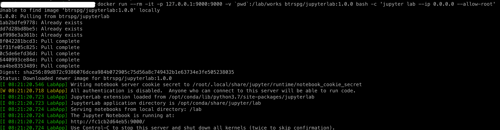
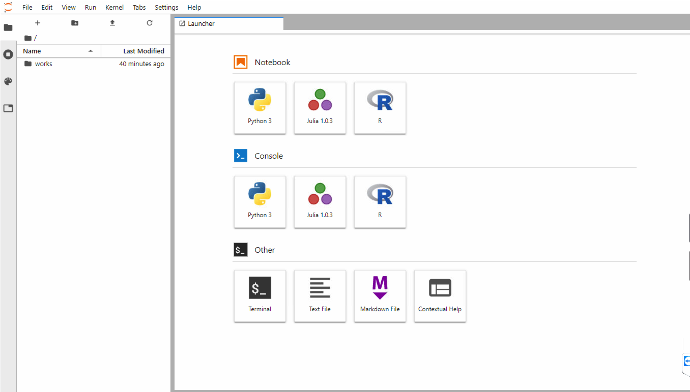

# jupyterlab

省去自己配置的时间，直接在服务器上直接使用

```shell script
docker run --rm -it -p 8888:9000 \
    -v `pwd`:/lab/works btrspg/jupyterlab:1.0.0 \
    bash -c 'jupyter lab --ip 0.0.0.0 --allow-root'
```
来启动服务。


其中`pwd`可以替换成工作目录（包含数据/脚本/）

## Example

### 1. run in server



### 2. use in desktop

在desktop的浏览器上输入`服务器ip:8888`即可，工作目录挂载在works下




## 其他说明

- 本image只包含最基本的`python3.5`,`julia1.0.3`,`R3.5`包，
如果想要想要安装特定的包可以用过jupyerlab进行安装

```
!pip install pysam
#or
!conda install -c r ggplot2
```
但是安装完后，如果`container`停掉，所有恢复原装。如果有一直使用的包，建议自建image

自己写Dockerfile

```dockerfile
FROM btrspg/jupyterlab

RUN conda install -r anaconda bioconductor-deseq2
```

然后build

```shell script
docker build -t <user>/<name> .

docker run --rm -it -p 8888:9000 \
    -v `pwd`:/lab/works <user>/<name> \
    bash -c 'jupyter lab --ip 0.0.0.0 --allow-root'
```
即可

